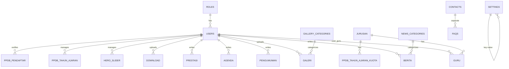

# Database Entity Relationship Diagram (ERD) & Schema
# SMK Teknologi Plus - Website & Admin Dashboard

---

## 1. ERD Overview



---

## 2. Table Definitions

### 2.1 Core Tables

#### `roles`
```sql
CREATE TABLE `roles` (
    `id` CHAR(36) NOT NULL PRIMARY KEY,           -- UUID
    `name` VARCHAR(50) NOT NULL UNIQUE,           -- 'super_admin', 'admin', 'editor', 'viewer'
    `display_name` VARCHAR(100) NOT NULL,         -- 'Super Admin', 'Admin', 'Editor', 'Viewer'
    `description` TEXT NULL,
    `permissions` JSON NULL,                      -- Granular permissions (future)
    `created_at` TIMESTAMP DEFAULT CURRENT_TIMESTAMP,
    `updated_at` TIMESTAMP DEFAULT CURRENT_TIMESTAMP ON UPDATE CURRENT_TIMESTAMP
) ENGINE=InnoDB DEFAULT CHARSET=utf8mb4 COLLATE=utf8mb4_unicode_ci;

-- Seed Data
INSERT INTO `roles` (`id`, `name`, `display_name`, `description`) VALUES
(UUID(), 'super_admin', 'Super Admin', 'Full system access including user management'),
(UUID(), 'admin', 'Admin', 'Content management and master data'),
(UUID(), 'editor', 'Editor', 'Create and manage own content'),
(UUID(), 'viewer', 'Viewer', 'Read-only dashboard access');
```

#### `users`
```sql
CREATE TABLE `users` (
    `id` CHAR(36) NOT NULL PRIMARY KEY,           -- UUID
    `role_id` CHAR(36) NOT NULL,
    `name` VARCHAR(150) NOT NULL,
    `email` VARCHAR(150) NOT NULL UNIQUE,
    `username` VARCHAR(50) NULL UNIQUE,           -- Optional login alternative
    `password_hash` VARCHAR(255) NOT NULL,        -- Bcrypt
    `avatar` VARCHAR(500) NULL,                   -- URL/Path to photo
    `phone` VARCHAR(20) NULL,
    `is_active` BOOLEAN NOT NULL DEFAULT TRUE,
    `last_login_at` TIMESTAMP NULL,
    `email_verified_at` TIMESTAMP NULL,
    `deleted_at` TIMESTAMP NULL,                  -- Soft Delete
    `created_at` TIMESTAMP DEFAULT CURRENT_TIMESTAMP,
    `updated_at` TIMESTAMP DEFAULT CURRENT_TIMESTAMP ON UPDATE CURRENT_TIMESTAMP,
    
    FOREIGN KEY (`role_id`) REFERENCES `roles`(`id`) ON UPDATE CASCADE ON DELETE RESTRICT,
    INDEX `idx_users_role` (`role_id`),
    INDEX `idx_users_email` (`email`),
    INDEX `idx_users_active` (`is_active`),
    INDEX `idx_users_deleted` (`deleted_at`)
) ENGINE=InnoDB DEFAULT CHARSET=utf8mb4 COLLATE=utf8mb4_unicode_ci;
```

#### `jurusan` (Departments/Majors)
```sql
CREATE TABLE `jurusan` (
    `id` CHAR(36) NOT NULL PRIMARY KEY,
    `kode` VARCHAR(10) NOT NULL UNIQUE,           -- 'TKJ', 'RPL', 'TKR', 'MM'
    `nama` VARCHAR(150) NOT NULL,
    `singkatan` VARCHAR(20) NULL,
    `deskripsi` TEXT NULL,
    `visi_misi` JSON NULL,                        -- {visi: "...", misi: ["...", "..."]}
    `kompetensi_keahlian` TEXT NULL,
    `kurikulum` TEXT NULL,
    `prospek_karir` TEXT NULL,
    `foto_header` VARCHAR(500) NULL,
    `guru_koordinator_id` CHAR(36) NULL,          -- FK ke guru (SET NULL on delete)
    `urutan` INT NOT NULL DEFAULT 0,              -- Display order
    `is_active` BOOLEAN NOT NULL DEFAULT TRUE,
    `deleted_at` TIMESTAMP NULL,
    `created_at` TIMESTAMP DEFAULT CURRENT_TIMESTAMP,
    `updated_at` TIMESTAMP DEFAULT CURRENT_TIMESTAMP ON UPDATE CURRENT_TIMESTAMP,
    
    FOREIGN KEY (`guru_koordinator_id`) REFERENCES `guru`(`id`) ON UPDATE CASCADE ON DELETE SET NULL,
    INDEX `idx_jurusan_active` (`is_active`),
    INDEX `idx_jurusan_urutan` (`urutan`),
    INDEX `idx_jurusan_deleted` (`deleted_at`)
) ENGINE=InnoDB DEFAULT CHARSET=utf8mb4 COLLATE=utf8mb4_unicode_ci;
```

#### `guru` (Teachers/Staff)
```sql
CREATE TABLE `guru` (
    `id` CHAR(36) NOT NULL PRIMARY KEY,
    `user_id` CHAR(36) NULL UNIQUE,               -- Link ke users (optional, untuk login guru)
    `nip_nik` VARCHAR(30) NULL UNIQUE,            -- NIP/NIK
    `nama` VARCHAR(150) NOT NULL,
    `jenis_kelamin` ENUM('L', 'P') NOT NULL,
    `tempat_lahir` VARCHAR(100) NULL,
    `tanggal_lahir` DATE NULL,
    `alamat` TEXT NULL,
    `telepon` VARCHAR(20) NULL,
    `email` VARCHAR(150) NULL,
    `foto` VARCHAR(500) NULL,
    `jabatan` VARCHAR(100) NULL,                  -- 'Kepala Sekolah', 'Wakasek', 'Guru BK', 'Guru Mapel'
    `jurusan_id` CHAR(36) NULL,                   -- Null untuk Kepsek/Wakasek/Staff TU
    `status` ENUM('aktif', 'pensiun', 'mutasi', 'non_aktif') NOT NULL DEFAULT 'aktif',
    `urutan` INT NOT NULL DEFAULT 0,
    `deleted_at` TIMESTAMP NULL,
    `created_at` TIMESTAMP DEFAULT CURRENT_TIMESTAMP,
    `updated_at` TIMESTAMP DEFAULT CURRENT_TIMESTAMP ON UPDATE CURRENT_TIMESTAMP,
    
    FOREIGN KEY (`user_id`) REFERENCES `users`(`id`) ON UPDATE CASCADE ON DELETE SET NULL,
    FOREIGN KEY (`jurusan_id`) REFERENCES `jurusan`(`id`) ON UPDATE CASCADE ON DELETE SET NULL,
    INDEX `idx_guru_jurusan` (`jurusan_id`),
    INDEX `idx_guru_status` (`status`),
    INDEX `idx_guru_urutan` (`urutan`),
    INDEX `idx_guru_deleted` (`deleted_at`)
) ENGINE=InnoDB DEFAULT CHARSET=utf8mb4 COLLATE=utf8mb4_unicode_ci;
```

#### `ekstrakurikuler`
```sql
CREATE TABLE `ekstrakurikuler` (
    `id` CHAR(36) NOT NULL PRIMARY KEY,
    `nama` VARCHAR(150) NOT NULL,
    `pembina_id` CHAR(36) NULL,                   -- FK ke guru
    `deskripsi` TEXT NULL,
    `jam_pelaksanaan` VARCHAR(100) NULL,          -- 'Senin, 15:00-17:00'
    `foto` VARCHAR(500) NULL,
    `is_active` BOOLEAN NOT NULL DEFAULT TRUE,
    `deleted_at` TIMESTAMP NULL,
    `created_at` TIMESTAMP DEFAULT CURRENT_TIMESTAMP,
    `updated_at` TIMESTAMP DEFAULT CURRENT_TIMESTAMP ON UPDATE CURRENT_TIMESTAMP,
    
    FOREIGN KEY (`pembina_id`) REFERENCES `guru`(`id`) ON UPDATE CASCADE ON DELETE SET NULL,
    INDEX `idx_ekstrakurikuler_active` (`is_active`),
    INDEX `idx_ekstrakurikuler_deleted` (`deleted_at`)
) ENGINE=InnoDB DEFAULT CHARSET=utf8mb4 COLLATE=utf8mb4_unicode_ci;
```

---

### 2.2 Content Tables

#### `news_categories`
```sql
CREATE TABLE `news_categories` (
    `id` CHAR(36) NOT NULL PRIMARY KEY,
    `name` VARCHAR(100) NOT NULL UNIQUE,
    `slug` VARCHAR(120) NOT NULL UNIQUE,
    `description` TEXT NULL,
    `color` VARCHAR(7) NULL,                      -- Hex color for UI badge
    `is_active` BOOLEAN NOT NULL DEFAULT TRUE,
    `deleted_at` TIMESTAMP NULL,
    `created_at` TIMESTAMP DEFAULT CURRENT_TIMESTAMP,
    `updated_at` TIMESTAMP DEFAULT CURRENT_TIMESTAMP ON UPDATE CURRENT_TIMESTAMP,
    
    INDEX `idx_news_cat_slug` (`slug`),
    INDEX `idx_news_cat_active` (`is_active`)
) ENGINE=InnoDB DEFAULT CHARSET=utf8mb4 COLLATE=utf8mb4_unicode_ci;

-- Seed: 'pengumuman', 'prestasi', 'kegiatan', 'ppdb', 'umum'
```

#### `berita` (News)
```sql
CREATE TABLE `berita` (
    `id` CHAR(36) NOT NULL PRIMARY KEY,
    `category_id` CHAR(36) NOT NULL,
    `author_id` CHAR(36) NOT NULL,                -- FK ke users
    `title` VARCHAR(255) NOT NULL,
    `slug` VARCHAR(280) NOT NULL UNIQUE,          -- SEO friendly URL
    `excerpt` TEXT NULL,                          -- Short description for cards
    `content` LONGTEXT NOT NULL,                  -- HTML dari Rich Text Editor
    `thumbnail` VARCHAR(500) NULL,                -- Hero image
    `tags` JSON NULL,                             -- Array of strings
    `meta_seo` JSON NULL,                         -- {title, description, og_image, twitter_card}
    `status` ENUM('draft', 'published', 'archived') NOT NULL DEFAULT 'draft',
    `published_at` TIMESTAMP NULL,
    `view_count` INT NOT NULL DEFAULT 0,
    `is_featured` BOOLEAN NOT NULL DEFAULT FALSE, -- Untuk tampilan utama
    `deleted_at` TIMESTAMP NULL,
    `created_at` TIMESTAMP DEFAULT CURRENT_TIMESTAMP,
    `updated_at` TIMESTAMP DEFAULT CURRENT_TIMESTAMP ON UPDATE CURRENT_TIMESTAMP,
    
    FOREIGN KEY (`category_id`) REFERENCES `news_categories`(`id`) ON UPDATE CASCADE ON DELETE RESTRICT,
    FOREIGN KEY (`author_id`) REFERENCES `users`(`id`) ON UPDATE CASCADE ON DELETE RESTRICT,
    INDEX `idx_berita_slug` (`slug`),
    INDEX `idx_berita_category` (`category_id`),
    INDEX `idx_berita_status` (`status`),
    INDEX `idx_berita_published` (`published_at`),
    INDEX `idx_berita_author` (`author_id`),
    INDEX `idx_berita_featured` (`is_featured`),
    INDEX `idx_berita_deleted` (`deleted_at`),
    FULLTEXT INDEX `ft_berita_search` (`title`, `excerpt`, `content`)
) ENGINE=InnoDB DEFAULT CHARSET=utf8mb4 COLLATE=utf8mb4_unicode_ci;
```

#### `pengumuman` (Announcements)
```sql
CREATE TABLE `pengumuman` (
    `id` CHAR(36) NOT NULL PRIMARY KEY,
    `author_id` CHAR(36) NOT NULL,
    `title` VARCHAR(255) NOT NULL,
    `content` LONGTEXT NOT NULL,
    `priority` ENUM('low', 'medium', 'high') NOT NULL DEFAULT 'medium',
    `start_date` DATE NOT NULL,
    `end_date` DATE NULL,                         -- Null = tidak kadaluarsa
    `is_pinned` BOOLEAN NOT NULL DEFAULT FALSE,   -- Pin di atas
    `is_active` BOOLEAN NOT NULL DEFAULT TRUE,
    `deleted_at` TIMESTAMP NULL,
    `created_at` TIMESTAMP DEFAULT CURRENT_TIMESTAMP,
    `updated_at` TIMESTAMP DEFAULT CURRENT_TIMESTAMP ON UPDATE CURRENT_TIMESTAMP,
    
    FOREIGN KEY (`author_id`) REFERENCES `users`(`id`) ON UPDATE CASCADE ON DELETE RESTRICT,
    INDEX `idx_pengumuman_dates` (`start_date`, `end_date`),
    INDEX `idx_pengumuman_priority` (`priority`),
    INDEX `idx_pengumuman_active` (`is_active`),
    INDEX `idx_pengumuman_deleted` (`deleted_at`)
) ENGINE=InnoDB DEFAULT CHARSET=utf8mb4 COLLATE=utf8mb4_unicode_ci;
```

#### `agenda` (Events/Calendar)
```sql
CREATE TABLE `agenda` (
    `id` CHAR(36) NOT NULL PRIMARY KEY,
    `author_id` CHAR(36) NOT NULL,
    `title` VARCHAR(255) NOT NULL,
    `description` TEXT NULL,
    `location` VARCHAR(255) NULL,
    `start_date` DATE NOT NULL,
    `end_date` DATE NOT NULL,
    `start_time` TIME NULL,
    `end_time` TIME NULL,
    `image` VARCHAR(500) NULL,
    `status` ENUM('upcoming', 'ongoing', 'completed', 'cancelled') NOT NULL DEFAULT 'upcoming',
    `is_active` BOOLEAN NOT NULL DEFAULT TRUE,
    `deleted_at` TIMESTAMP NULL,
    `created_at` TIMESTAMP DEFAULT CURRENT_TIMESTAMP,
    `updated_at` TIMESTAMP DEFAULT CURRENT_TIMESTAMP ON UPDATE CURRENT_TIMESTAMP,
    
    FOREIGN KEY (`author_id`) REFERENCES `users`(`id`) ON UPDATE CASCADE ON DELETE RESTRICT,
    INDEX `idx_agenda_dates` (`start_date`, `end_date`),
    INDEX `idx_agenda_status` (`status`),
    INDEX `idx_agenda_active` (`is_active`),
    INDEX `idx_agenda_deleted` (`deleted_at`)
) ENGINE=InnoDB DEFAULT CHARSET=utf8mb4 COLLATE=utf8mb4_unicode_ci;
```

#### `prestasi` (Achievements)
```sql
CREATE TABLE `prestasi` (
    `id` CHAR(36) NOT NULL PRIMARY KEY,
    `author_id` CHAR(36) NOT NULL,
    `title` VARCHAR(255) NOT NULL,
    `tingkat` ENUM('sekolah', 'kabupaten', 'provinsi', 'nasional', 'internasional') NOT NULL,
    `jenis` ENUM('akademik', 'non_akademik', 'olahraga', 'seni', 'lainnya') NOT NULL,
    `tahun` YEAR NOT NULL,
    `juara` ENUM('1', '2', '3', 'harapan_1', 'harapan_2', 'harapan_3', 'lainnya') NOT NULL,
    `description` TEXT NULL,
    `image` VARCHAR(500) NULL,                    -- Foto sertifikat/medali
    `siswa_guru_terlibat` JSON NULL,              -- Array {nama, nis/nip, peran}
    `is_active` BOOLEAN NOT NULL DEFAULT TRUE,
    `deleted_at` TIMESTAMP NULL,
    `created_at` TIMESTAMP DEFAULT CURRENT_TIMESTAMP,
    `updated_at` TIMESTAMP DEFAULT CURRENT_TIMESTAMP ON UPDATE CURRENT_TIMESTAMP,
    
    FOREIGN KEY (`author_id`) REFERENCES `users`(`id`) ON UPDATE CASCADE ON DELETE RESTRICT,
    INDEX `idx_prestasi_tingkat` (`tingkat`),
    INDEX `idx_prestasi_jenis` (`jenis`),
    INDEX `idx_prestasi_tahun` (`tahun`),
    INDEX `idx_prestasi_active` (`is_active`),
    INDEX `idx_prestasi_deleted` (`deleted_at`)
) ENGINE=InnoDB DEFAULT CHARSET=utf8mb4 COLLATE=utf8mb4_unicode_ci;
```

---

### 2.3 Media & Gallery Tables

#### `gallery_categories`
```sql
CREATE TABLE `gallery_categories` (
    `id` CHAR(36) NOT NULL PRIMARY KEY,
    `name` VARCHAR(100) NOT NULL UNIQUE,
    `slug` VARCHAR(120) NOT NULL UNIQUE,
    `description` TEXT NULL,
    `icon` VARCHAR(50) NULL,                      -- Icon name (Lucide)
    `is_active` BOOLEAN NOT NULL DEFAULT TRUE,
    `deleted_at` TIMESTAMP NULL,
    `created_at` TIMESTAMP DEFAULT CURRENT_TIMESTAMP,
    `updated_at` TIMESTAMP DEFAULT CURRENT_TIMESTAMP ON UPDATE CURRENT_TIMESTAMP,
    
    INDEX `idx_gal_cat_slug` (`slug`),
    INDEX `idx_gal_cat_active` (`is_active`)
) ENGINE=InnoDB DEFAULT CHARSET=utf8mb4 COLLATE=utf8mb4_unicode_ci;

-- Seed: 'kegiatan', 'fasilitas', 'prestasi', 'ekstrakurikuler', 'lainnya'
```

#### `galeri` (Gallery)
```sql
CREATE TABLE `galeri` (
    `id` CHAR(36) NOT NULL PRIMARY KEY,
    `category_id` CHAR(36) NOT NULL,
    `uploader_id` CHAR(36) NOT NULL,
    `title` VARCHAR(255) NOT NULL,
    `description` TEXT NULL,
    `images` JSON NOT NULL,                       -- Array of {url, thumbnail, medium, alt, order}
    `event_date` DATE NULL,
    `is_active` BOOLEAN NOT NULL DEFAULT TRUE,
    `deleted_at` TIMESTAMP NULL,
    `created_at` TIMESTAMP DEFAULT CURRENT_TIMESTAMP,
    `updated_at` TIMESTAMP DEFAULT CURRENT_TIMESTAMP ON UPDATE CURRENT_TIMESTAMP,
    
    FOREIGN KEY (`category_id`) REFERENCES `gallery_categories`(`id`) ON UPDATE CASCADE ON DELETE RESTRICT,
    FOREIGN KEY (`uploader_id`) REFERENCES `users`(`id`) ON UPDATE CASCADE ON DELETE RESTRICT,
    INDEX `idx_galeri_category` (`category_id`),
    INDEX `idx_galeri_date` (`event_date`),
    INDEX `idx_galeri_active` (`is_active`),
    INDEX `idx_galeri_deleted` (`deleted_at`)
) ENGINE=InnoDB DEFAULT CHARSET=utf8mb4 COLLATE=utf8mb4_unicode_ci;
```

#### `hero_slider`
```sql
CREATE TABLE `hero_slider` (
    `id` CHAR(36) NOT NULL PRIMARY KEY,
    `title` VARCHAR(255) NOT NULL,
    `subtitle` TEXT NULL,
    `image_desktop` VARCHAR(500) NOT NULL,
    `image_mobile` VARCHAR(500) NULL,             -- Optional separate mobile image
    `cta_text` VARCHAR(100) NULL,
    `cta_link` VARCHAR(500) NULL,
    `position` ENUM('left', 'center', 'right') NOT NULL DEFAULT 'center',
    `overlay_opacity` TINYINT NOT NULL DEFAULT 40, -- 0-100
    `order` INT NOT NULL DEFAULT 0,
    `start_date` DATE NULL,
    `end_date` DATE NULL,
    `is_active` BOOLEAN NOT NULL DEFAULT TRUE,
    `deleted_at` TIMESTAMP NULL,
    `created_at` TIMESTAMP DEFAULT CURRENT_TIMESTAMP,
    `updated_at` TIMESTAMP DEFAULT CURRENT_TIMESTAMP ON UPDATE CURRENT_TIMESTAMP,
    
    INDEX `idx_hero_order` (`order`),
    INDEX `idx_hero_dates` (`start_date`, `end_date`),
    INDEX `idx_hero_active` (`is_active`),
    INDEX `idx_hero_deleted` (`deleted_at`)
) ENGINE=InnoDB DEFAULT CHARSET=utf8mb4 COLLATE=utf8mb4_unicode_ci;
```

---

### 2.4 PPDB Tables

#### `ppdb_tahun_ajaran` (Academic Year for PPDB)
```sql
CREATE TABLE `ppdb_tahun_ajaran` (
    `id` CHAR(36) NOT NULL PRIMARY KEY,
    `tahun_ajaran` VARCHAR(20) NOT NULL UNIQUE,   -- '2025/2026'
    `gelombang` INT NOT NULL DEFAULT 1,           -- 1, 2, 3
    `kuota_total` INT NOT NULL DEFAULT 0,
    `tanggal_buka` DATE NOT NULL,
    `tanggal_tutup` DATE NOT NULL,
    `tanggal_pengumuman` DATE NULL,
    `syarat_ketentuan` LONGTEXT NULL,             -- Rich Text
    `form_fields` JSON NULL,                      -- Dynamic form config (future)
    `is_active` BOOLEAN NOT NULL DEFAULT TRUE,
    `deleted_at` TIMESTAMP NULL,
    `created_at` TIMESTAMP DEFAULT CURRENT_TIMESTAMP,
    `updated_at` TIMESTAMP DEFAULT CURRENT_TIMESTAMP ON UPDATE CURRENT_TIMESTAMP,
    
    INDEX `idx_ppdb_ta_active` (`is_active`),
    INDEX `idx_ppdb_ta_dates` (`tanggal_buka`, `tanggal_tutup`),
    INDEX `idx_ppdb_ta_deleted` (`deleted_at`)
) ENGINE=InnoDB DEFAULT CHARSET=utf8mb4 COLLATE=utf8mb4_unicode_ci;
```

#### `ppdb_tahun_ajaran_kuota` (Quota per Jurusan per Tahun Ajaran)
```sql
CREATE TABLE `ppdb_tahun_ajaran_kuota` (
    `id` CHAR(36) NOT NULL PRIMARY KEY,
    `tahun_ajaran_id` CHAR(36) NOT NULL,
    `jurusan_id` CHAR(36) NOT NULL,
    `kuota_zonasi` INT NOT NULL DEFAULT 0,
    `kuota_afirmasi` INT NOT NULL DEFAULT 0,
    `kuota_prestasi` INT NOT NULL DEFAULT 0,
    `kuota_perpindahan` INT NOT NULL DEFAULT 0,
    `created_at` TIMESTAMP DEFAULT CURRENT_TIMESTAMP,
    `updated_at` TIMESTAMP DEFAULT CURRENT_TIMESTAMP ON UPDATE CURRENT_TIMESTAMP,
    
    FOREIGN KEY (`tahun_ajaran_id`) REFERENCES `ppdb_tahun_ajaran`(`id`) ON UPDATE CASCADE ON DELETE CASCADE,
    FOREIGN KEY (`jurusan_id`) REFERENCES `jurusan`(`id`) ON UPDATE CASCADE ON DELETE CASCADE,
    UNIQUE KEY `uk_ppdb_kuota` (`tahun_ajaran_id`, `jurusan_id`),
    INDEX `idx_ppdb_kuota_ta` (`tahun_ajaran_id`)
) ENGINE=InnoDB DEFAULT CHARSET=utf8mb4 COLLATE=utf8mb4_unicode_ci;
```

#### `ppdb_pendaftar` (Applicants)
```sql
CREATE TABLE `ppdb_pendaftar` (
    `id` CHAR(36) NOT NULL PRIMARY KEY,
    `tahun_ajaran_id` CHAR(36) NOT NULL,
    `nomor_pendaftaran` VARCHAR(30) NOT NULL UNIQUE, -- Auto-generated: PPDB-2025-00001
    
    -- Data Pribadi
    `nisn` VARCHAR(20) NOT NULL,
    `nama_lengkap` VARCHAR(150) NOT NULL,
    `jenis_kelamin` ENUM('L', 'P') NOT NULL,
    `tempat_lahir` VARCHAR(100) NOT NULL,
    `tanggal_lahir` DATE NOT NULL,
    `agama` VARCHAR(50) NULL,
    `nik` VARCHAR(16) NULL,
    `alamat` TEXT NOT NULL,
    `rt_rw` VARCHAR(20) NULL,
    `kelurahan` VARCHAR(100) NULL,
    `kecamatan` VARCHAR(100) NULL,
    `kota_kabupaten` VARCHAR(100) NULL,
    `provinsi` VARCHAR(100) NULL,
    `kode_pos` VARCHAR(10) NULL,
    `telepon` VARCHAR(20) NULL,
    `email` VARCHAR(150) NULL,
    `asal_sekolah` VARCHAR(200) NOT NULL,
    `npsn_sekolah` VARCHAR(20) NULL,
    `alamat_sekolah` TEXT NULL,
    
    -- Data Orang Tua / Wali
    `nama_ayah` VARCHAR(150) NULL,
    `nik_ayah` VARCHAR(16) NULL,
    `pekerjaan_ayah` VARCHAR(100) NULL,
    `penghasilan_ayah` VARCHAR(50) NULL,
    `telepon_ayah` VARCHAR(20) NULL,
    `nama_ibu` VARCHAR(150) NULL,
    `nik_ibu` VARCHAR(16) NULL,
    `pekerjaan_ibu` VARCHAR(100) NULL,
    `penghasilan_ibu` VARCHAR(50) NULL,
    `telepon_ibu` VARCHAR(20) NULL,
    `nama_wali` VARCHAR(150) NULL,
    `nik_wali` VARCHAR(16) NULL,
    `pekerjaan_wali` VARCHAR(100) NULL,
    `penghasilan_wali` VARCHAR(50) NULL,
    `telepon_wali` VARCHAR(20) NULL,
    `alamat_ortu` TEXT NULL,
    
    -- Pilihan Jurusan
    `pilihan_1_id` CHAR(36) NOT NULL,
    `pilihan_2_id` CHAR(36) NULL,
    `jalur` ENUM('zonasi', 'afirmasi', 'prestasi', 'perpindahan') NOT NULL,
    
    -- Berkas (JSON Array of {type, url, verified})
    `berkas` JSON NULL,
    
    -- Status & Verifikasi
    `status` ENUM('baru', 'diverifikasi', 'diterima', 'cadangan', 'ditolak') NOT NULL DEFAULT 'baru',
    `catatan_verifikasi` TEXT NULL,
    `verified_by` CHAR(36) NULL,
    `verified_at` TIMESTAMP NULL,
    
    `deleted_at` TIMESTAMP NULL,
    `created_at` TIMESTAMP DEFAULT CURRENT_TIMESTAMP,
    `updated_at` TIMESTAMP DEFAULT CURRENT_TIMESTAMP ON UPDATE CURRENT_TIMESTAMP,
    
    FOREIGN KEY (`tahun_ajaran_id`) REFERENCES `ppdb_tahun_ajaran`(`id`) ON UPDATE CASCADE ON DELETE RESTRICT,
    FOREIGN KEY (`pilihan_1_id`) REFERENCES `jurusan`(`id`) ON UPDATE CASCADE ON DELETE RESTRICT,
    FOREIGN KEY (`pilihan_2_id`) REFERENCES `jurusan`(`id`) ON UPDATE CASCADE ON DELETE SET NULL,
    FOREIGN KEY (`verified_by`) REFERENCES `users`(`id`) ON UPDATE CASCADE ON DELETE SET NULL,
    INDEX `idx_ppdb_pendaftar_ta` (`tahun_ajaran_id`),
    INDEX `idx_ppdb_pendaftar_status` (`status`),
    INDEX `idx_ppdb_pendaftar_jalur` (`jalur`),
    INDEX `idx_ppdb_pendaftar_nisn` (`nisn`),
    INDEX `idx_ppdb_pendaftar_nomor` (`nomor_pendaftaran`),
    INDEX `idx_ppdb_pendaftar_deleted` (`deleted_at`)
) ENGINE=InnoDB DEFAULT CHARSET=utf8mb4 COLLATE=utf8mb4_unicode_ci;
```

---

### 2.5 Download & Utility Tables

#### `downloads`
```sql
CREATE TABLE `downloads` (
    `id` CHAR(36) NOT NULL PRIMARY KEY,
    `uploader_id` CHAR(36) NOT NULL,
    `category_id` CHAR(36) NULL,                  -- Optional category
    `title` VARCHAR(255) NOT NULL,
    `description` TEXT NULL,
    `file_url` VARCHAR(500) NOT NULL,
    `file_name` VARCHAR(255) NOT NULL,
    `file_size` BIGINT NOT NULL,                  -- Bytes
    `file_type` VARCHAR(100) NOT NULL,            -- MIME type
    `download_count` INT NOT NULL DEFAULT 0,
    `is_active` BOOLEAN NOT NULL DEFAULT TRUE,
    `deleted_at` TIMESTAMP NULL,
    `created_at` TIMESTAMP DEFAULT CURRENT_TIMESTAMP,
    `updated_at` TIMESTAMP DEFAULT CURRENT_TIMESTAMP ON UPDATE CURRENT_TIMESTAMP,
    
    FOREIGN KEY (`uploader_id`) REFERENCES `users`(`id`) ON UPDATE CASCADE ON DELETE RESTRICT,
    INDEX `idx_downloads_active` (`is_active`),
    INDEX `idx_downloads_deleted` (`deleted_at`)
) ENGINE=InnoDB DEFAULT CHARSET=utf8mb4 COLLATE=utf8mb4_unicode_ci;
```

#### `download_categories` (Optional)
```sql
CREATE TABLE `download_categories` (
    `id` CHAR(36) NOT NULL PRIMARY KEY,
    `name` VARCHAR(100) NOT NULL UNIQUE,
    `slug` VARCHAR(120) NOT NULL UNIQUE,
    `description` TEXT NULL,
    `icon` VARCHAR(50) NULL,
    `is_active` BOOLEAN NOT NULL DEFAULT TRUE,
    `deleted_at` TIMESTAMP NULL,
    `created_at` TIMESTAMP DEFAULT CURRENT_TIMESTAMP,
    `updated_at` TIMESTAMP DEFAULT CURRENT_TIMESTAMP ON UPDATE CURRENT_TIMESTAMP,
    
    INDEX `idx_dl_cat_slug` (`slug`)
) ENGINE=InnoDB DEFAULT CHARSET=utf8mb4 COLLATE=utf8mb4_unicode_ci;

-- Seed: 'formulir', 'dokumen', 'kurikulum', 'lainnya'
```

#### `contacts` (Contact Form Submissions)
```sql
CREATE TABLE `contacts` (
    `id` CHAR(36) NOT NULL PRIMARY KEY,
    `name` VARCHAR(150) NOT NULL,
    `email` VARCHAR(150) NOT NULL,
    `subject` VARCHAR(255) NOT NULL,
    `message` TEXT NOT NULL,
    `ip_address` VARCHAR(45) NULL,
    `user_agent` TEXT NULL,
    `is_read` BOOLEAN NOT NULL DEFAULT FALSE,
    `replied_at` TIMESTAMP NULL,
    `replied_by` CHAR(36) NULL,
    `deleted_at` TIMESTAMP NULL,
    `created_at` TIMESTAMP DEFAULT CURRENT_TIMESTAMP,
    
    FOREIGN KEY (`replied_by`) REFERENCES `users`(`id`) ON UPDATE CASCADE ON DELETE SET NULL,
    INDEX `idx_contacts_read` (`is_read`),
    INDEX `idx_contacts_created` (`created_at`),
    INDEX `idx_contacts_deleted` (`deleted_at`)
) ENGINE=InnoDB DEFAULT CHARSET=utf8mb4 COLLATE=utf8mb4_unicode_ci;
```

#### `faqs`
```sql
CREATE TABLE `faqs` (
    `id` CHAR(36) NOT NULL PRIMARY KEY,
    `category` VARCHAR(100) NOT NULL,             -- 'umum', 'ppdb', 'akademik', 'lainnya'
    `question` TEXT NOT NULL,
    `answer` LONGTEXT NOT NULL,                   -- HTML allowed
    `order` INT NOT NULL DEFAULT 0,
    `is_active` BOOLEAN NOT NULL DEFAULT TRUE,
    `deleted_at` TIMESTAMP NULL,
    `created_at` TIMESTAMP DEFAULT CURRENT_TIMESTAMP,
    `updated_at` TIMESTAMP DEFAULT CURRENT_TIMESTAMP ON UPDATE CURRENT_TIMESTAMP,
    
    INDEX `idx_faqs_category` (`category`),
    INDEX `idx_faqs_order` (`order`),
    INDEX `idx_faqs_active` (`is_active`),
    INDEX `idx_faqs_deleted` (`deleted_at`)
) ENGINE=InnoDB DEFAULT CHARSET=utf8mb4 COLLATE=utf8mb4_unicode_ci;
```

#### `facilities` (Fasilitas Sekolah)
```sql
CREATE TABLE `facilities` (
    `id` CHAR(36) NOT NULL PRIMARY KEY,
    `name` VARCHAR(150) NOT NULL,
    `description` TEXT NULL,
    `image` VARCHAR(500) NULL,
    `icon` VARCHAR(50) NULL,
    `order` INT NOT NULL DEFAULT 0,
    `is_active` BOOLEAN NOT NULL DEFAULT TRUE,
    `deleted_at` TIMESTAMP NULL,
    `created_at` TIMESTAMP DEFAULT CURRENT_TIMESTAMP,
    `updated_at` TIMESTAMP DEFAULT CURRENT_TIMESTAMP ON UPDATE CURRENT_TIMESTAMP,
    
    INDEX `idx_facilities_order` (`order`),
    INDEX `idx_facilities_active` (`is_active`),
    INDEX `idx_facilities_deleted` (`deleted_at`)
) ENGINE=InnoDB DEFAULT CHARSET=utf8mb4 COLLATE=utf8mb4_unicode_ci;
```

---

### 2.6 Settings & Configuration

#### `settings` (Key-Value Store for Website Config)
```sql
CREATE TABLE `settings` (
    `id` CHAR(36) NOT NULL PRIMARY KEY,
    `setting_key` VARCHAR(100) NOT NULL UNIQUE,
    `setting_group` VARCHAR(50) NOT NULL,         -- 'identity', 'social', 'seo', 'footer', 'email', 'maintenance'
    `setting_type` ENUM('string', 'text', 'json', 'boolean', 'integer', 'file') NOT NULL DEFAULT 'string',
    `value` LONGTEXT NULL,                        -- JSON string for complex types
    `label` VARCHAR(150) NOT NULL,
    `description` TEXT NULL,
    `is_public` BOOLEAN NOT NULL DEFAULT FALSE,   -- Expose to frontend public API
    `validation_rules` JSON NULL,                 -- Zod schema as JSON (future)
    `order` INT NOT NULL DEFAULT 0,
    `created_at` TIMESTAMP DEFAULT CURRENT_TIMESTAMP,
    `updated_at` TIMESTAMP DEFAULT CURRENT_TIMESTAMP ON UPDATE CURRENT_TIMESTAMP,
    
    INDEX `idx_settings_group` (`setting_group`),
    INDEX `idx_settings_public` (`is_public`),
    INDEX `idx_settings_order` (`order`)
) ENGINE=InnoDB DEFAULT CHARSET=utf8mb4 COLLATE=utf8mb4_unicode_ci;

-- Seed Data (Key Examples):
-- identity: school_name, school_short_name, npsn, nsm, address, phone, email, website, logo, favicon
-- social: facebook, instagram, youtube, tiktok, twitter, whatsapp
-- seo: meta_title, meta_description, meta_keywords, og_image_default, google_analytics_id, search_console_code
-- footer: copyright_text, quick_links (JSON), disclaimer
-- email: smtp_host, smtp_port, smtp_user, smtp_pass, smtp_from_name, smtp_from_email, smtp_encryption
-- maintenance: mode (boolean), message, allowed_roles (JSON array)
```

---

### 2.7 Audit & Logging (Optional but Recommended)

#### `activity_logs`
```sql
CREATE TABLE `activity_logs` (
    `id` CHAR(36) NOT NULL PRIMARY KEY,
    `user_id` CHAR(36) NULL,
    `action` VARCHAR(100) NOT NULL,               -- 'create', 'update', 'delete', 'login', 'logout', 'verify_ppdb'
    `model_type` VARCHAR(100) NULL,               -- 'Berita', 'Guru', 'PpdbPendaftar'
    `model_id` CHAR(36) NULL,
    `old_values` JSON NULL,
    `new_values` JSON NULL,
    `ip_address` VARCHAR(45) NULL,
    `user_agent` TEXT NULL,
    `created_at` TIMESTAMP DEFAULT CURRENT_TIMESTAMP,
    
    FOREIGN KEY (`user_id`) REFERENCES `users`(`id`) ON UPDATE CASCADE ON DELETE SET NULL,
    INDEX `idx_activity_user` (`user_id`),
    INDEX `idx_activity_model` (`model_type`, `model_id`),
    INDEX `idx_activity_action` (`action`),
    INDEX `idx_activity_created` (`created_at`)
) ENGINE=InnoDB DEFAULT CHARSET=utf8mb4 COLLATE=utf8mb4_unicode_ci;
```

---

## 3. Indexing Strategy Summary

| Table | Critical Indexes |
|-------|------------------|
| `users` | `email` (UNIQUE), `role_id`, `is_active`, `deleted_at` |
| `guru` | `jurusan_id`, `status`, `urutan`, `user_id` (UNIQUE) |
| `jurusan` | `kode` (UNIQUE), `is_active`, `urutan` |
| `berita` | `slug` (UNIQUE), `category_id`, `status`, `published_at`, `author_id`, `is_featured`, **FULLTEXT(title, excerpt, content)** |
| `pengumuman` | `start_date`, `end_date`, `priority`, `is_active` |
| `agenda` | `start_date`, `end_date`, `status` |
| `prestasi` | `tingkat`, `jenis`, `tahun`, `is_active` |
| `galeri` | `category_id`, `event_date`, `is_active` |
| `hero_slider` | `order`, `start_date`, `end_date`, `is_active` |
| `ppdb_pendaftar` | `tahun_ajaran_id`, `status`, `jalur`, `nomor_pendaftaran` (UNIQUE), `nisn` |
| `settings` | `setting_key` (UNIQUE), `setting_group`, `is_public` |

---

## 4. Migration Order (Dependencies)

```text
1. roles
2. users                        (FK -> roles)
3. jurusan
4. guru                         (FK -> users, jurusan)
5. ekstrakurikuler              (FK -> guru)
6. news_categories
7. gallery_categories
8. download_categories (optional)
9. berita                       (FK -> news_categories, users)
10. pengumuman                  (FK -> users)
11. agenda                      (FK -> users)
12. prestasi                    (FK -> users)
13. galeri                      (FK -> gallery_categories, users)
14. hero_slider
15. facilities
16. ppdb_tahun_ajaran
17. ppdb_tahun_ajaran_kuota     (FK -> ppdb_tahun_ajaran, jurusan)
18. ppdb_pendaftar              (FK -> ppdb_tahun_ajaran, jurusan x2, users)
19. downloads                   (FK -> users, download_categories)
20. contacts
21. faqs
22. settings
23. activity_logs               (FK -> users)
```

---

## 5. Sample Seed Data (Key Tables)

### `roles` - See Section 2.1

### `news_categories`
```sql
INSERT INTO `news_categories` (`id`, `name`, `slug`, `description`, `color`) VALUES
(UUID(), 'Pengumuman', 'pengumuman', 'Pengumuman resmi sekolah', '#EF4444'),
(UUID(), 'Prestasi', 'prestasi', 'Prestasi siswa dan guru', '#F59E0B'),
(UUID(), 'Kegiatan', 'kegiatan', 'Kegiatan sekolah', '#3B82F6'),
(UUID(), 'PPDB', 'ppdb', 'Informasi PPDB', '#10B981'),
(UUID(), 'Umum', 'umum', 'Berita umum', '#6B7280');
```

### `gallery_categories`
```sql
INSERT INTO `gallery_categories` (`id`, `name`, `slug`, `description`, `icon`) VALUES
(UUID(), 'Kegiatan Sekolah', 'kegiatan', 'Foto kegiatan belajar mengajar dan acara', 'calendar'),
(UUID(), 'Fasilitas', 'fasilitas', 'Foto fasilitas sekolah', 'building'),
(UUID(), 'Prestasi', 'prestasi', 'Foto prestasi dan penghargaan', 'award'),
(UUID(), 'Ekstrakurikuler', 'ekstrakurikuler', 'Foto kegiatan ekstrakurikuler', 'users'),
(UUID(), 'Lainnya', 'lainnya', 'Foto lainnya', 'image');
```

### `settings` (Selected Keys)
```sql
INSERT INTO `settings` (`id`, `setting_key`, `setting_group`, `setting_type`, `value`, `label`, `is_public`, `order`) VALUES
(UUID(), 'school_name', 'identity', 'string', 'SMK Teknologi Plus', 'Nama Sekolah', TRUE, 1),
(UUID(), 'school_short_name', 'identity', 'string', 'SMK TekPlus', 'Nama Singkat', TRUE, 2),
(UUID(), 'npsn', 'identity', 'string', '12345678', 'NPSN', TRUE, 3),
(UUID(), 'address', 'identity', 'text', 'Jl. Contoh No. 123, Kel. Contoh, Kec. Contoh, Kota Contoh, Provinsi', 'Alamat Lengkap', TRUE, 4),
(UUID(), 'phone', 'identity', 'string', '021-1234567', 'Telepon', TRUE, 5),
(UUID(), 'email', 'identity', 'string', 'info@smktekplus.sch.id', 'Email', TRUE, 6),
(UUID(), 'website', 'identity', 'string', 'https://smktekplus.sch.id', 'Website', TRUE, 7),
(UUID(), 'logo', 'identity', 'file', '/uploads/logo.png', 'Logo Sekolah', TRUE, 8),
(UUID(), 'favicon', 'identity', 'file', '/uploads/favicon.ico', 'Favicon', TRUE, 9),
(UUID(), 'facebook', 'social', 'string', 'https://facebook.com/smktekplus', 'Facebook', TRUE, 10),
(UUID(), 'instagram', 'social', 'string', 'https://instagram.com/smktekplus', 'Instagram', TRUE, 11),
(UUID(), 'youtube', 'social', 'string', 'https://youtube.com/@smktekplus', 'YouTube', TRUE, 12),
(UUID(), 'meta_title', 'seo', 'string', 'SMK Teknologi Plus - Sekolah Menengah Kejuruan Terdepan', 'Meta Title', TRUE, 20),
(UUID(), 'meta_description', 'seo', 'text', 'Website resmi SMK Teknologi Plus. Profil, jurusan, guru, prestasi, PPDB, berita, dan informasi sekolah.', 'Meta Description', TRUE, 21),
(UUID(), 'og_image_default', 'seo', 'file', '/uploads/og-default.jpg', 'Default OG Image', TRUE, 22),
(UUID(), 'copyright_text', 'footer', 'string', '© 2025 SMK Teknologi Plus. All rights reserved.', 'Copyright Text', TRUE, 30),
(UUID(), 'maintenance_mode', 'maintenance', 'boolean', 'false', 'Maintenance Mode', FALSE, 40),
(UUID(), 'maintenance_message', 'maintenance', 'text', 'Website sedang dalam pemeliharaan. Silakan coba lagi nanti.', 'Maintenance Message', FALSE, 41);
```

---

## 6. Views (Optional - For Reporting)

```sql
-- View: Guru dengan Nama Jurusan
CREATE VIEW `v_guru_with_jurusan` AS
SELECT g.*, j.nama AS jurusan_nama, j.kode AS jurusan_kode
FROM `guru` g
LEFT JOIN `jurusan` j ON g.jurusan_id = j.id
WHERE g.deleted_at IS NULL;

-- View: Berita dengan Kategori & Author
CREATE VIEW `v_berita_with_details` AS
SELECT b.*, nc.name AS category_name, nc.slug AS category_slug, nc.color AS category_color,
       u.name AS author_name, u.avatar AS author_avatar
FROM `berita` b
JOIN `news_categories` nc ON b.category_id = nc.id
JOIN `users` u ON b.author_id = u.id
WHERE b.deleted_at IS NULL AND nc.deleted_at IS NULL AND u.deleted_at IS NULL;

-- View: PPDB Pendaftar dengan Detail Jurusan
CREATE VIEW `v_ppdb_pendaftar_detail` AS
SELECT p.*, 
       j1.nama AS pilihan_1_nama, j1.kode AS pilihan_1_kode,
       j2.nama AS pilihan_2_nama, j2.kode AS pilihan_2_kode,
       v.name AS verified_by_name,
       ta.tahun_ajaran, ta.gelombang
FROM `ppdb_pendaftar` p
JOIN `jurusan` j1 ON p.pilihan_1_id = j1.id
LEFT JOIN `jurusan` j2 ON p.pilihan_2_id = j2.id
LEFT JOIN `users` v ON p.verified_by = v.id
JOIN `ppdb_tahun_ajaran` ta ON p.tahun_ajaran_id = ta.id
WHERE p.deleted_at IS NULL;
```

---

*Document Version: 1.0*
*Last Updated: 2026-07-19*
*Author: Database Architect*