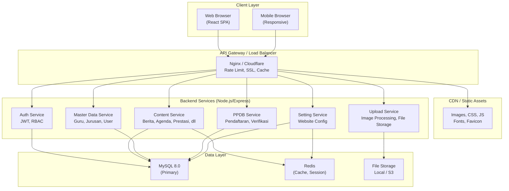
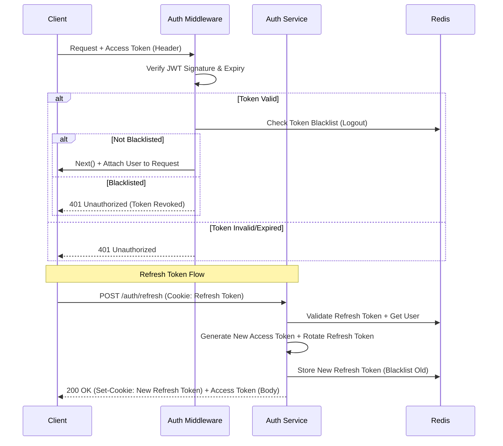
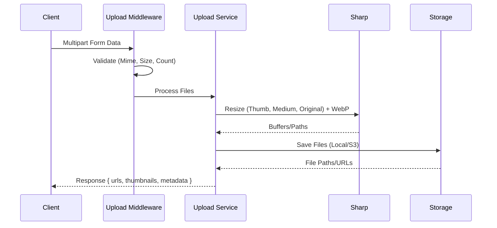

# System Design Document
# SMK Teknologi Plus - Website & Admin Dashboard

---

## 1. Architecture Overview

### 1.1 High-Level Architecture



### 1.2 Architectural Patterns
- **Monorepo**: Single repository, multiple packages (frontend, backend, shared)
- **Client-Server**: React SPA + RESTful API
- **Layered Architecture (Backend)**: Routes → Controllers → Services → Models/Repositories
- **Repository Pattern**: Abstraksi akses database (Knex.js)
- **Middleware Pipeline**: Express middleware chain (Auth, Validation, Error Handling, Logging)
- **Stateless Backend**: Horizontal scaling ready, session di Redis/JWT

---

## 2. Frontend Architecture (React + Vite)

### 2.1 Project Structure
```text
frontend/
├── public/
├── src/
│   ├── assets/              # Static assets (images, fonts)
│   ├── components/          # Shared UI Components (Atomic Design)
│   │   ├── ui/              # Base components (Button, Input, Card, Modal, etc.)
│   │   ├── layout/          # Layout components (Header, Footer, Sidebar, Container)
│   │   ├── forms/           # Form components (FormField, Select, DatePicker, RichText)
│   │   ├── data-display/    # Table, Card, Badge, Avatar, StatsCard, Chart
│   │   └── feedback/        # Toast, Tooltip, Loading, EmptyState, ErrorBoundary
│   ├── features/            # Feature-based modules (Domain-Driven)
│   │   ├── auth/            # Login, Register, ProtectedRoute, useAuth
│   │   ├── public/          # Public Website Pages
│   │   │   ├── home/
│   │   │   ├── profil/
│   │   │   ├── akademik/
│   │   │   ├── informasi/
│   │   │   ├── ppdb/
│   │   │   └── lain/
│   │   └── admin/           # Admin Dashboard Pages
│   │       ├── dashboard/
│   │       ├── users/
│   │       ├── guru/
│   │       ├── jurusan/
│   │       ├── berita/
│   │       ├── pengumuman/
│   │       ├── agenda/
│   │       ├── prestasi/
│   │       ├── galeri/
│   │       ├── hero-slider/
│   │       ├── ppdb/
│   │       ├── download/
│   │       └── setting/
│   ├── hooks/               # Custom Hooks (useDebounce, useLocalStorage, useMediaQuery)
│   ├── context/             # React Context (AuthContext, ThemeContext, ToastContext)
│   ├── services/            # API Layer (Axios Instance, Endpoints)
│   │   ├── api.ts           # Axios config, interceptors
│   │   ├── auth.ts
│   │   ├── public.ts
│   │   └── admin.ts
│   ├── utils/               # Helpers (formatDate, slugify, classNames, validation)
│   ├── styles/              # Global CSS, Tailwind Config, CSS Variables
│   ├── routes/              # Route Definitions (PublicRoutes, AdminRoutes)
│   ├── types/               # TypeScript Types (shared with backend via API contracts)
│   ├── App.tsx
│   └── main.tsx
├── index.html
├── package.json
├── tsconfig.json
├── vite.config.ts
├── tailwind.config.ts
└── .env.example
```

### 2.2 State Management Strategy
| Scope | Solution | Use Case |
|-------|----------|----------|
| **Server State** | TanStack Query (React Query) | Caching, Synchronization, Pagination, Infinite Query, Mutations |
| **Client State (Global)** | Zustand / React Context | Auth User, Theme, Sidebar State, Toast Notifications |
| **Form State** | React Hook Form + Zod | Validasi, Dirty Fields, Submit Handling |
| **URL State** | React Router + Search Params | Filter, Sort, Pagination, Search Query |

### 2.3 Routing Strategy
- **Public Routes**: `/`, `/profil/*`, `/akademik/*`, `/informasi/*`, `/ppdb/*`, `/download`, `/faq`, `/kontak`, `/galeri`
- **Admin Routes**: `/admin/*` (Protected, Role-based)
- **Auth Routes**: `/login`, `/logout` (Public, Redirect if authenticated)
- **404**: Catch-all di paling akhir

### 2.4 Performance Optimization
- **Code Splitting**: `React.lazy()` + `Suspense` per Route/Feature
- **Bundle Analysis**: `vite-plugin-bundle-analyzer`
- **Tree Shaking**: ES Modules, Side Effects False
- **Image Optimization**: `vite-plugin-imagemin`, Responsive Images via `<picture>` + `srcset`
- **Font Optimization**: `font-display: swap`, Preload Critical Fonts, Subset Fonts
- **Caching**: Service Worker (Workbox) untuk Offline/Static Assets

---

## 3. Backend Architecture (Node.js + Express)

### 3.1 Project Structure
```text
backend/
├── src/
│   ├── config/              # Configuration
│   │   ├── database.ts      # Knex Config (Development, Production, Test)
│   │   ├── redis.ts         # Redis Client
│   │   ├── jwt.ts           # JWT Config (Secret, Expiry, Algorithm)
│   │   ├── multer.ts        # Multer Config (Storage, Limits, FileFilter)
│   │   └── env.ts           # Validated Env Vars (Zod)
│   ├── middlewares/         # Express Middlewares
│   │   ├── authenticate.ts  # Verify Access Token
│   │   ├── authorize.ts     # RBAC Check
│   │   ├── validate.ts      # Zod Validation (Body, Query, Params)
│   │   ├── errorHandler.ts  # Global Error Handler
│   │   ├── rateLimiter.ts   # Rate Limiting (Express-Rate-Limit)
│   │   ├── cors.ts          # CORS Config
│   │   ├── helmet.ts        # Security Headers
│   │   ├── logger.ts        # Morgan + Winston
│   │   └── notFound.ts      # 404 Handler
│   ├── modules/             # Feature Modules (Domain-Driven)
│   │   ├── auth/
│   │   │   ├── auth.routes.ts
│   │   │   ├── auth.controller.ts
│   │   │   ├── auth.service.ts
│   │   │   ├── auth.validator.ts
│   │   │   └── auth.types.ts
│   │   ├── users/
│   │   ├── guru/
│   │   ├── jurusan/
│   │   ├── ekstrakurikuler/
│   │   ├── hero-slider/
│   │   ├── berita/
│   │   ├── pengumuman/
│   │   ├── agenda/
│   │   ├── prestasi/
│   │   ├── galeri/
│   │   ├── download/
│   │   ├── ppdb/
│   │   │   ├── ppdb-tahun-ajaran/
│   │   │   └── ppdb-pendaftar/
│   │   ├── setting/
│   │   └── upload/
│   ├── shared/              # Shared Utilities
│   │   ├── database/        # Knex Instance, BaseRepository
│   │   ├── errors/          # Custom Error Classes (AppError, ValidationError, NotFoundError)
│   │   ├── utils/           # Helpers (slugify, generateToken, hashPassword, fileUpload)
│   │   ├── types/           # Shared Types (ApiResponse, PaginatedResponse, JWTPayload)
│   │   └── constants/       # Constants (Roles, Status, File Limits)
│   ├── app.ts               # Express App Setup (Middleware, Routes)
│   └── server.ts            # Entry Point (DB Connect, Listen)
├── database/
│   ├── migrations/          # Knex Migrations (Timestamped)
│   └── seeders/             # Knex Seeders
├── tests/                   # Unit & Integration Tests
├── package.json
├── tsconfig.json
├── knexfile.ts
├── jest.config.ts
└── .env.example
```

### 3.2 Module Architecture (Clean Architecture Light)
```
Module (e.g., berita)
├── berita.routes.ts       # Route Definitions (GET, POST, PUT, DELETE)
├── berita.controller.ts   # Request/Response Handling, Call Service
├── berita.service.ts      # Business Logic, Transaction, Call Repository
├── berita.repository.ts   # Database Queries (Knex), Single Responsibility
├── berita.validator.ts    # Zod Schemas (Create, Update, Query Params)
├── berita.types.ts        # Types (DTO, Entity, Query Params)
└── index.ts               # Barrel Export
```

### 3.3 Database Access Layer (Knex.js)
- **BaseRepository**: CRUD Generics (findAll, findById, create, update, delete, paginate)
- **Query Builder**: Type-safe (Knex + TypeScript), Parameterized Queries
- **Transactions**: `knex.transaction()` untuk operasi multi-tabel
- **Migrations**: Versioned, Reversible, CI/CD Integrated
- **Seeders**: Environment-specific (Development vs Production)

### 3.4 Authentication & Authorization Flow



### 3.5 RBAC Implementation
```typescript
// Middleware authorize.ts
export const authorize = (...allowedRoles: Role[]) => {
  return (req: Request, res: Response, next: NextFunction) => {
    const user = req.user; // Attached by authenticate middleware
    if (!user) return res.status(401).json({ message: 'Unauthorized' });
    if (!allowedRoles.includes(user.role)) {
      return res.status(403).json({ message: 'Forbidden: Insufficient role' });
    }
    next();
  };
};

// Usage in Routes
router.get('/', authenticate, authorize('super_admin'), userController.getAll);
router.post('/', authenticate, authorize('super_admin', 'admin'), beritaController.create);
```

### 3.6 Error Handling Strategy
- **Custom Error Classes**: `AppError`, `ValidationError`, `NotFoundError`, `UnauthorizedError`, `ForbiddenError`, `ConflictError`
- **Global Error Handler**: Normalize response format, Log error (Winston), Hide stack trace in production
- **Response Format**:
```json
{
  "success": false,
  "message": "Validation failed",
  "errors": [
    { "field": "email", "message": "Invalid email format" }
  ],
  "timestamp": "2026-07-19T10:30:00.000Z",
  "path": "/api/berita"
}
```

### 3.7 Caching Strategy (Redis)
| Data | TTL | Invalidation Strategy |
|------|-----|----------------------|
| Public Berita List | 5 min | On Create/Update/Delete Berita |
| Public Pengumuman | 5 min | On Create/Update/Delete |
| Public Agenda | 5 min | On Create/Update/Delete |
| Hero Slider | 10 min | On Create/Update/Delete/Reorder |
| Setting Website | 30 min | On Update Setting |
| Guru/Jurusan List | 10 min | On Create/Update/Delete |
| PPDB Kuota/Info | 5 min | On Update Tahun Ajaran |

**Cache Key Pattern**: `cache:{resource}:{query_hash}` (e.g., `cache:berita:list:page=1:limit=10:kategori=prestasi`)

---

## 4. Database Design

### 4.1 ERD Overview
*See [DATABASE_ERD.md](./DATABASE_ERD.md) for detailed schema.*

### 4.2 Key Design Decisions
- **UUID** untuk Primary Key (kecuali tabel referensi kecil seperti roles)
- **Soft Delete**: Kolom `deleted_at` (nullable timestamp) di semua tabel konten
- **Timestamps**: `created_at`, `updated_at` otomatis (Knex `timestamps(true, true)`)
- **Slug**: Unique, Generated dari Judul, Digunakan untuk Public URL SEO-friendly
- **JSON Columns**: Untuk data fleksibel (setting, meta_seo, form_fields_ppdb)
- **Indexes**: Foreign Keys, Slug, Status, Published_at, Composite Index untuk Filter+Sort

### 4.3 Migration Strategy
- **Naming**: `YYYYMMDDHHMMSS_description.ts` (e.g., `20260719103000_create_users_table.ts`)
- **Up/Down**: Reversible, Tested di CI
- **Run**: `knex migrate:latest` (Startup/Deploy), `knex migrate:rollback` (Emergency)

---

## 5. API Design (RESTful)

### 5.1 Conventions
| Aspect | Convention |
|--------|------------|
| **Base URL** | `/api/v1` |
| **Naming** | Kebab-case plural nouns (`/hero-slider`, `/news-categories`) |
| **Versioning** | URL Path (`/api/v1/`) |
| **Auth** | Bearer Token (Access Token) + HttpOnly Cookie (Refresh Token) |
| **Pagination** | Query: `page`, `limit` (default 10, max 100) |
| **Filtering** | Query: `search`, `status`, `kategori_id`, `tahun`, `date_from`, `date_to` |
| **Sorting** | Query: `sort_by`, `sort_order` (asc/desc) |
| **Response Envelope** | `{ success, message, data, meta, errors }` |

### 5.2 Standard Response Format
```typescript
// Success
{
  "success": true,
  "message": "Data retrieved successfully",
  "data": { ... } | [ ... ],
  "meta": {           // For paginated responses
    "page": 1,
    "limit": 10,
    "total": 100,
    "totalPages": 10
  }
}

// Error
{
  "success": false,
  "message": "Validation failed",
  "errors": [ { "field": "title", "message": "Title is required" } ]
}
```

### 5.3 HTTP Status Codes
| Code | Usage |
|------|-------|
| 200 | GET, PUT, PATCH Success |
| 201 | POST Success (Created) |
| 204 | DELETE Success (No Content) |
| 400 | Bad Request (Validation Error) |
| 401 | Unauthorized (Invalid/Expired Token) |
| 403 | Forbidden (Insufficient Role) |
| 404 | Not Found |
| 409 | Conflict (Duplicate Unique) |
| 422 | Unprocessable Entity (Business Logic Error) |
| 429 | Too Many Requests (Rate Limit) |
| 500 | Internal Server Error |

---

## 6. File Upload & Storage

### 6.1 Upload Flow


### 6.2 Image Processing (Sharp)
| Variant | Width | Format | Quality | Use Case |
|---------|-------|--------|---------|----------|
| Thumbnail | 400px | WebP | 80% | List Grid, Card |
| Medium | 800px | WebP | 85% | Detail Page, Modal |
| Original | Max 1920px | WebP | 90% | Download, Fullscreen |
| **Fallback** | - | Original (JPG/PNG) | - | Browser tidak support WebP |

### 6.3 Security
- **MIME Validation**: `image/jpeg`, `image/png`, `image/webp`, `application/pdf`, `application/msword`, `application/vnd.openxmlformats-officedocument.wordprocessingml.document`, `application/vnd.ms-excel`, `application/vnd.openxmlformats-officedocument.spreadsheetml.sheet`, `application/zip`
- **Extension Validation**: Whitelist
- **Filename**: UUID + Timestamp + Sanitized Original Name
- **Storage Path**: `/uploads/{type}/{year}/{month}/{uuid}.webp` (Outside Public Root)
- **Access**: Signed URL / Authenticated Route untuk Private Files

---

## 7. Security Architecture

### 7.1 Defense in Depth
| Layer | Controls |
|-------|----------|
| **Network** | Cloudflare WAF, DDoS Protection, Rate Limiting, SSL/TLS 1.3 |
| **Application** | Helmet (CSP, HSTS, X-Frame-Options), CORS Whitelist, Input Validation (Zod), Output Encoding |
| **Authentication** | JWT RS256, Short-lived Access Token (15m), HttpOnly Secure Refresh Token (7d), Rotation, Blacklist |
| **Authorization** | RBAC Middleware, Resource-level Permission (Future), Owner-based Access (Editor own content) |
| **Data** | Parameterized Queries (Knex), Encryption at Rest (MySQL TDE), PII Minimization |
| **File Upload** | MIME + Extension Validation, Sharp Re-encoding (Strip Metadata), Virus Scan (Future), Separate Storage |
| **Logging & Monitoring** | Winston (Structured JSON), Audit Trail (Login, CRUD Critical), Alert on Anomaly |

### 7.2 Secrets Management
- **Development**: `.env` (gitignored), `.env.example` (committed)
- **Production**: Environment Variables (Server/Container), Vault/Secrets Manager (Future)
- **Rotation**: JWT Secret, Database Password, SMTP Password - Quarterly

---

## 8. Deployment Architecture

### 8.1 Environments
| Environment | Purpose | Domain | Database |
|-------------|---------|--------|----------|
| **Local** | Development | `localhost:5173` (FE), `localhost:3000` (BE) | Local MySQL |
| **Staging** | Testing/QA | `staging.smktekplus.sch.id` | Staging MySQL |
| **Production** | Live | `smktekplus.sch.id` | Production MySQL (Primary + Replica) |

### 8.2 Infrastructure (Recommended)
```
┌─────────────────────────────────────┐
│         Cloudflare (DNS, CDN, WAF, SSL)          │
└─────────────────┬───────────────────┘
                  │
┌─────────────────▼───────────────────┐
│        Nginx Reverse Proxy          │
│  (SSL Termination, Gzip, Cache,     │
│   Rate Limit, Static Files)         │
└─────────────────┬───────────────────┘
                  │
        ┌─────────┴─────────┐
        ▼                   ▼
┌───────────────┐   ┌───────────────┐
│  Frontend     │   │  Backend      │
│  (Nginx/      │   │  (Node.js     │
│   Static)     │   │   + PM2)      │
└───────────────┘   └───────┬───────┘
                            │
              ┌─────────────┼─────────────┐
              ▼             ▼             ▼
        ┌──────────┐ ┌──────────┐ ┌──────────┐
        │ MySQL    │ │ Redis    │ │ File     │
        │ Primary  │ │ Cluster  │ │ Storage  │
        └──────────┘ └──────────┘ └──────────┘
```

### 8.3 CI/CD Pipeline (GitHub Actions)
```yaml
# .github/workflows/ci.yml
on: [push, pull_request]
jobs:
  lint-test:
    runs-on: ubuntu-latest
    steps:
      - checkout
      - setup-node
      - cache-node-modules
      - install-deps
      - lint (ESLint, Stylelint, Prettier)
      - typecheck (tsc --noEmit)
      - test (Jest + Coverage)
      - build-frontend (Vite)
      - build-backend (tsc)

  deploy-staging:
    needs: lint-test
    if: github.ref == 'refs/heads/develop'
    runs-on: ubuntu-latest
    steps:
      - deploy to staging server (SSH/Docker)
      - run migrations
      - health check
      - notify

  deploy-production:
    needs: lint-test
    if: github.ref == 'refs/heads/main' && github.event_name == 'release'
    runs-on: ubuntu-latest
    environment: production
    steps:
      - deploy to production (Blue/Green or Rolling)
      - run migrations
      - health check
      - smoke test
      - notify
```

---

## 9. Monitoring & Observability

### 9.1 Logging
- **Format**: JSON (Winston)
- **Levels**: error, warn, info, http, debug
- **Correlation ID**: Request ID (UUID) propagated across services
- **Output**: File (Rotated Daily) + Stdout (Docker/PM2) → Log Aggregator (ELK/Loki - Future)

### 9.2 Metrics (Prometheus + Grafana - Future)
- **Application**: Request Rate, Latency (p50, p95, p99), Error Rate, Active Connections
- **Business**: Daily Active Users, PPDB Submissions, Content Published, Download Count
- **System**: CPU, Memory, Disk, Network, DB Connections, Redis Memory

### 9.3 Alerting
- **Critical**: API Down, DB Connection Failed, Disk > 90%, Error Rate > 5%
- **Warning**: High Latency (p99 > 2s), Memory > 80%, Queue Backlog
- **Channels**: Email, Telegram/Slack Webhook

### 9.4 Health Checks
- `GET /health` → `{ status: 'ok', timestamp, uptime, version, checks: { database: 'ok', redis: 'ok' } }`
- `GET /health/ready` → Readiness Probe (Kubernetes)
- `GET /health/live` → Liveness Probe

---

## 10. Backup & Disaster Recovery

### 10.1 Backup Strategy
| Asset | Frequency | Retention | Method |
|-------|-----------|-----------|--------|
| **Database** | Daily (02:00 WIB) | 30 Days | `mysqldump` + Compress + Encrypt → S3/Wasabi |
| **Database** | Hourly (Binlog) | 7 Days | Point-in-Time Recovery (PITR) |
| **File Storage** | Daily | 30 Days | Rsync / S3 Sync (Versioning Enabled) |
| **Code & Config** | Per Commit | Forever | Git (GitHub) |

### 10.2 Recovery Objectives
- **RPO (Recovery Point Objective)**: 1 Hour (Binlog)
- **RTO (Recovery Time Objective)**: 4 Hours (Restore + Verify)

### 10.3 Disaster Recovery Plan
1. Provision New Server (IaC - Terraform/Ansible)
2. Restore Database from Latest Backup + Binlog Replay
3. Restore File Storage
4. Deploy Application (CI/CD Pipeline)
5. Update DNS (Cloudflare API)
6. Verify Health Checks & Smoke Tests
7. Communicate to Stakeholders

---

## 11. Technology Decisions (ADR Log)

| ADR | Decision | Rationale |
|-----|----------|-----------|
| **001** | Monorepo (Single Repo) | Simplified dependency sharing, atomic commits, easier refactoring |
| **002** | React + Vite (Not Next.js) | Simpler for SPA, Team familiarity, No SSR complexity for MVP |
| **003** | Tailwind CSS + Shadcn/UI | Rapid UI dev, Consistent design system, No CSS-in-JS runtime |
| **004** | Knex.js (Not Prisma/TypeORM) | Full SQL control, Lightweight, Migration flexibility, Performance |
| **005** | JWT + HttpOnly Cookie (Refresh) | Secure against XSS (Access Token in Memory), CSRF Protection (SameSite=Strict) |
| **006** | RS256 (Asymmetric) for JWT | Key Rotation without invalidating all tokens, Separation of Sign/Verify keys |
| **007** | Zod for Validation | TypeScript-first, Schema inference, Shared types between FE/BE |
| **008** | TanStack Query for Server State | Best-in-class caching, deduping, background refetch, optimistic updates |
| **009** | Sharp for Image Processing | Fast, WebP support, Responsive variants, Metadata stripping |
| **010** | MySQL 8.0 (InnoDB) | ACID, JSON Support, CTE, Window Functions, Widely Supported |

---

*Document Version: 1.0*
*Last Updated: 2026-07-19*
*Author: Architecture Team*